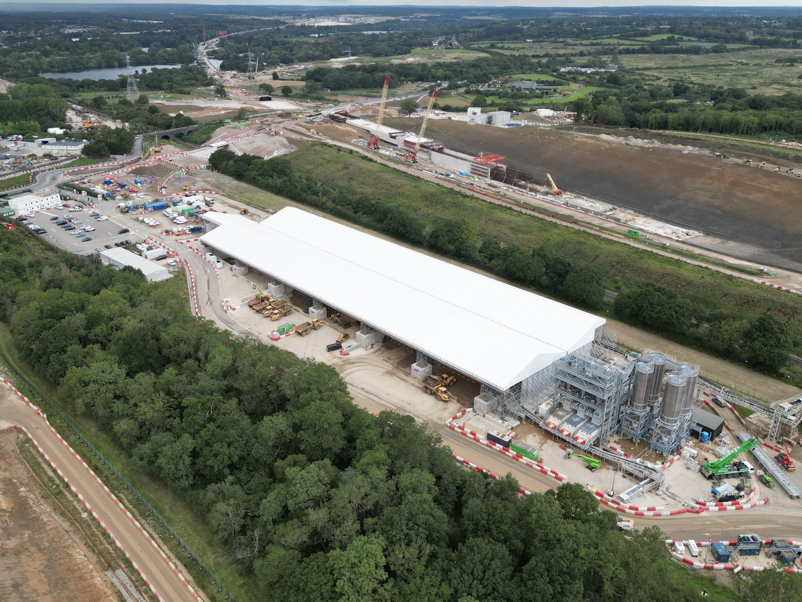

# 👋 Hi, I'm Toby Ralph.
An enthusiastic Engineer aspiring to drive forward the construction industry and inspire others to pursue a career in STEM. 
## About me
- 🧑🏻‍💻 Technical Manager at [Lev3l Products](lev3l.co.uk)
- 👀 I’m interested in Structural & Mechanical Engineering, Fitness, Investing, Finance and Business. 
- 🌱 I’m currently learning Python OOP for applications of Structural Engineering in the Temporary Works industry.
- 📫 How to reach me tobyralph@icloud.com
- ⚡ Fun fact: I'm a graduate from The University of Sheffield

## CPD
- Creation of an open-source [Python library](https://github.com/to8yr/roof) for analysis and material list generation of Temporary Roofs; with the goal of developing a fully featured web app. 
- Study of European [Structural](https://knowledge.bsigroup.com/products/eurocode-basis-of-structural-and-geotechnical-design?version=standard) & [Quality](https://www.bsigroup.com/en-GB/capabilities/quality-management/iso-9001-quality-management-systems/) Standards
- Business, Finance, and Law for Engineers
## Experience
### Technical Manager, [Lev3l Products](https://lev3l.co.uk/), Feb 24 - Present
- Co-founder of a new company with the vision of designing innovative, intuitive, and safe products for the construction industry. 
- Development and maintenance of aluminium truss technical information.
- Custom hanging bracket design, analysis and testing for hanging scaffolding from the underside of a bridge. 
- Relationship building with Suppliers across the world and creation of supply-chain cost analysis tool. 
### Graduate Engineer, [Altrad DESSA](https://www.altrad-dessa.com/), Oct 22 - Feb 24
- Led the development of structural calculations for a new roofing system for the events industry. Advanced my knowledge of aluminium and steel truss design.
- Created and implemented technical report templates following attendance of a course delivered by the IMechE.
- Travelled to the UAE to deliver a technical presentation teaching a group of engineers the structural analysis of temporary roofs and AutoCAD dynamic block creation. 
### Final Year Project, Sep 21 - May 22
- Titled “Compressive behaviour of 3D printed thermoplastic polyurethane lattices for Athletic midsoles”. 
- Learnt to research effectively, compress information, solve problems, and present my findings in front of an audience. 
- Use of Ansys APDL to model and simulate complex additively manufactured geometries. 
- Use of 3D printer and physical testing to validate my analysis model. 
### Computer-aided Design Technician, Daitob, Sep 21 - Apr 22
- Designed bespoke oak Orangeries using Fusion software to create concise engineering drawings for use on-site. 
- Generation of accurate parts lists for quotation and stock maintenance. 
### Engineering You're Hired! Feb 21
- Collaborated remotely with a multidisciplinary team to design a solution for electric air travel. 
- Together my team decided to focus on the fright sector. We developed ideas for autonomous airships that work in swarms to achieve low-emission transit. 
- Translated ideas into CAD & FEA software where we inspected our design's capability to operate during bad weather. 
- Presented our ideas with relevant research to a board of experts working within the sector, listened to their feedback and answered any questions.
### Global Engineering Challenge, Jan 20
- Worked in a multinational multidisciplinary team to design a solution to limited water supply in Maker’s Valley, Johannesburg.
- Initially, we identified stakeholders and researched the root of the problem. 
- Together we recognised that the main issue was that underground water pipes would frequently leak. We developed a system that would detect leaks by measuring the flow rates at each end of the pipes. 
## Education & Qualifications
### BEng(Hons) Mechanical Engineering, The University of Sheffield, Sep 19 - Jul 22
Achieved Second Class Division One (2:1) - Accredited by The Institution of Mechanical Engineers. Favorite modules:
- Integrity of Materials and Components
- Mechanics of Deformable Solids
- Dynamics of Structures and Machines
- Managing Engineering Projects and Teams
- Finance and Law for Engineers
- Materials Processing
- Finite Element Techniques
- Computations and Numerical Methods
- Design of Structures, Machines and Systems
- Manufacturing systems
### A-levels, Francis Combe Academy Sep 17 - Jul 19
- Mathematics (A)
- Physics (A)
- Chemistry (B)
- Further Mathematics (C)
## Skills
### Adept learner
I'm passionate about my continuous improvement and enjoy pushing myself to new heights.
### Programming
Proficient in Python with experience using MATLAB, Rust, Excel VB and JavaScript. 
### Computer-Aided Design
Fluent in various CAD software namely Fusion, AutoCAD, SketchUp, Ansys and Blender. 
### Structural Analysis
Experienced using various structural analysis software such as SkyCiv S3D & API, Advance Design, Fusion, Ansys and OpenSees. Recently ventured with my own programming knowledge to develop my own 3D Frame analysis tool in Python.
### Licenced Drone Operator
Provide photography and photogrammetry to Lev3l's partners.
## Hobbies & Interests
### Swimming
Continue to train following graduation from my university swimming team. 
### Fitness & Nutrition
I've made fitness a part of my daily routine and am interested in exploring various aspects of nutrition.
### Investing, Economics & Finance
I'm passionate about understanding economic trends and their impact on financial markets, which has fueled my interest in investing and personal finance management.
